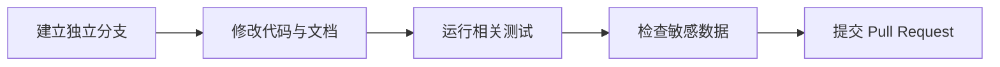

# 参与开发

使用 Python 3.11 或更新版本，按照 README 创建独立环境、安装依赖。

提交前运行 `python -m pytest -q`。测试会使用临时数据库；不要改成自己的项目数据库。
桌面窗口验证需要 Windows、WebView2 和编译后的启动器；浏览器验证需要 Playwright 浏览器。
Burp 打包验证需要先构建扩展 JAR，缺少 EXE 或 JAR 构建产物时对应二进制检查跳过。

提交问题时请说明版本、系统、复现步骤、预期和实际结果。日志和截图先脱敏。
修改授权范围、网络执行、凭据存储和报告导出的代码应附带相关回归验证。

不要提交 `.env`、密钥、真实目标、客户报告、数据库、证据截图、备份、运行日志或本机环境。
生成的 EXE、DLL、JAR 和发布 ZIP 通过发布附件分发，不放进源码提交。

本项目尚未指定开源许可证；第三方依赖与引用遵循各自许可证。
