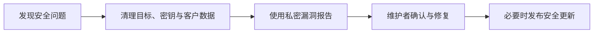

# 安全问题反馈

```mermaid
flowchart LR
    A[发现安全问题] --> B[清理目标、密钥与客户数据]
    B --> C[使用私密漏洞报告]
    C --> D[维护者确认与修复]
    D --> E[必要时发布安全更新]
```

请勿在公开 Issue 中附带密钥、未脱敏证据、客户目标或可被立即利用的完整细节。
若仓库启用了 GitHub 私密漏洞报告，请使用该渠道；否则先联系维护者确认私密反馈方式。

反馈建议包含受影响版本、前置条件、最小复现、影响和建议修复。
目前没有对外承诺响应时限或长期支持周期。

SnowEdge 用于授权范围内的安全评估。AI 输出是待验证建议，交付前需要人工确认。
