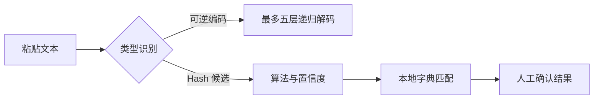

# 数据分析与 Hash 本地匹配

入口：导航中的「数据分析」（保留 /decoder 旧地址）。

## 使用方法

粘贴内容后点击「识别与分析」。编码可连续处理最多五层；JWT 仅解析，不验证签名。
Hash 显示候选算法与置信度。选择算法和已启用字典后点击「开始本地匹配」。可取消，页面显示数量、速度和耗时。

内置 common.txt 是 14 条的小型示例字典，不代表完整弱口令覆盖。自定义 UTF-8 TXT 最大 256 MB、单行最大 4096 字节；在后台请求线程流式导入，导入后默认禁用，需手动启用并选择运行。

## 判断与误报控制

固定前缀、分隔符、字段结构优先；无前缀的裸 Hex 根据长度给出候选。
32 位 Hex 不能唯一确定 MD5，也可能是 NTLM、MD4、LM 或随机数据。中/低置信度是定性提示，不是概率。
清晰的可打印 UTF-8 Hex 文本可解码；二进制摘要停止递归。可打印性仍不证明来源。
JWT、JWE 和 OpenSSL Salted__ 分别解析或提示密钥要求；未知数据不会仅凭外观被断言为密文。
匹配值是当前算法下的候选密码，不证明唯一原始明文。未命中只说明当前字典未找到匹配。

## 架构与文件

- app/services/hash_analysis/detector.py：格式检测与候选分类。
- algorithms.py：摘要算法及独立 MD4/NTLM 实现。
- dictionary.py：本地字典存储、导入、统计、启停与删除。
- matcher.py：两个后台执行线程、最多四个活跃任务、取消与内存结果管理。
- providers.py：HashLookupProvider 接口，默认无 Provider，明确确认后才能调用。
- hashcat.py：可选本地 HashcatAdapter 执行，固定参数、不使用 shell。
- app/hash_routes.py：字典、任务、取消、清除和扩展接口。
- app/services/auto_decode.py：每层解码前分类，遇摘要停止。
- app/templates/decoder.html、app/static/hash-analysis.js、analysis.css：分析结果与渐进展开界面。
- app/static/consistency.css、templates/base.html、templates/project.html：浅色组件、导航标签及窄屏修正。
- app/local_security.py：数据分析响应禁止缓存。
- data/passwords/common.txt：随源码和发布包分发的小字典。
- tests/test_hash_analysis.py、scripts/qa_hash_analysis.py：独立算法、任务、API 与浏览器检查。
- scripts/build-release.py、scripts/prepare-github.py：确保仅包含内置字典，不包含用户字典和结果。

## 数据边界

输入及匹配结果不进入项目证据、普通日志、AI 或遥测。不自动调用联网服务。
任务只存内存，最多 32 个；完成结果 15 分钟后不可查询，下次任务清理过期对象。关闭页面或点「清空敏感内容」会取消并清除当前任务。
重启服务不恢复任务。内存任务适合当前单 Web 进程桌面模式，多 Web 进程部署需另做会话路由。
自定义字典保存在 .runtime/hash-dictionaries（或 SNOWEDGE_STATE_DIR 下），可能包含敏感密码，应自行管理本机访问权限。

Hashcat 必须自行安装并加入 PATH。当前支持字典及转小写规则，单个任务最多一小时；取消会终止子进程。禁用 potfile、restore 和普通日志，输入、结果和状态暂存系统临时目录，正常结束时删除；进程或系统异常退出可能留下临时目录，需要检查清理。
Hashcat 模式依据官方示例：https://hashcat.net/wiki/doku.php?id=example_hashes 。实际 GPU 运行依赖用户设备和驱动；自动化仅覆盖适配接口，未代表真实 GPU 验证。

## 可验证样例

| 输入 | 结果 |
|---|---|
| e10adc3949ba59abbe56e057f20f883e | MD5/NTLM/MD4/LM 候选；MD5 + common 命中 123456 |
| 5f4dcc3b5aa765d61d8327deb882cf99 | MD5 + common 命中 password |
| 8846f7eaee8fb117ad06bdd830b7586c | NTLM + common 命中 password |
| U25vd0VkZ2U= | Base64 → SnowEdge |
| 536e6f7745646765 | Hex 文本 → SnowEdge |

执行 `python -m pytest -q` 和 `python scripts/qa_hash_analysis.py`。浏览器测试使用临时数据库，并覆盖 1440px/390px、字典命中、清空、Hex 解码、窄屏导航及深色组件审计。

## 本次验证结果（2026-09-13）

全量测试：246 passed；其中 Hash 模块相关测试 47 项。存在一条既有 Starlette/AnyIO 弃用提示。
浏览器实际验证通过：MD5 字典命中、Hex 解码、清空敏感内容、390px 导航开关与无横向溢出。首页、工具箱、项目页和请求页的深色背景审计均无遗留项。
Hashcat 使用模拟进程验证调用、结果读取与参数边界；尚未进行真实 GPU 运行。联网测试只使用本地假 Provider，没有提交客户 Hash。
README.md 已补充入口和边界说明，GitHub 源码包已同步。

### 浅色主题源头整理

统一 style.css、workspace.css、solo.css 的旧背景、边框及文字配色，保留半透明遮罩。资产页上下文详情调整为可读的浅色文本区。
从真实项目导航遍历 38 个有效页面并展开 details，所有页面返回 200，未检测到黑色实底组件；浏览器工作台完整交互回归通过。测试范围为临时项目数据，不代表所有数据驱动的弹窗状态。
