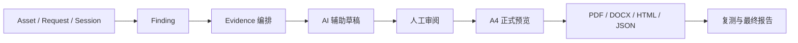

# 报告交付工作流

本次升级扩展原有 Finding、Evidence、请求工作台和交付快照。不会迁移、清空或覆盖已有项目数据。入口为项目中的「报告」。原执行分析、浏览器观察、知识分析、闭环统计以及 txb02 Word 仍在「兼容导出与历史分析」中。

## 日常操作

1. 创建项目，填写客户、测试时间、人员和授权范围，导入资产与请求。
2. 在原漏洞入口或报告中心手工新建 Finding；报告中心的「编辑详情与 Evidence」可编辑标题、风险、类型、参数、CWE、OWASP、原理、影响、验证过程、CVSS、利用难度和修复建议。
3. 从已有请求中选择正常请求、POC、复测请求，以及各自的已保存回放。已有请求交接证据和权限对比会自动关联；保存编辑时固定回放编号。
4. 添加或引用 Evidence，填写说明、图注、顺序，选择是否纳入。截图使用原有附件与遮挡标注机制。移除是从后续报告中排除，不销毁原始证据和旧报告。
5. 可请求 AI 草稿。系统向已配置的 AI 服务发送选中的脱敏证据；必须返回现有引用，演示模式和无证据情况不会伪造成功。草稿需先带入编辑区，人工核对后保存，不自动修改 Finding。
6. 选择模板、交付阶段、版本及漏洞，按风险、资产、类型或手工编号排序，生成交付版本。
7. 在浅色 A4 分页界面核对真实 PDF 页面，可缩放和跳转。导出 PDF、HTML、JSON、CSV、DOCX 均返回实际文件。
8. 整改后添加「复测」证据并填写结论，保留初测证据，再生成复测或最终版本。旧快照不随 Finding 编辑改变。

## 正式内容

封面、项目概况、风险结论与统计图、覆盖情况、漏洞汇总和逐项漏洞章节。章节包括保存的正常/POC/复测 HTTP、身份对比、Evidence、截图、修复建议、参考资料与复测时间线。未填写的内容标记「未记录」，缺少验证过程或证据会列出核对提示。

- 标准与客户模板：完整章节；客户版不自动加入原平台内部执行分析。
- 扫描模板：完整条目，并明确区分自动探测和人工验证。
- 复测模板：突出整改状态与复测结论，同时保留初测资料。
- 简版技术模板：省略 HTTP 与证据正文，保留摘要、图注和截图；同版本 JSON 仍保存完整投影。
- 自定义模板编辑器尚未提供。

## HTTP 与证据边界

新导入原始请求保留 HTTP 文本结构并脱敏。新执行回放会保存当次请求、响应协议状态行、多值响应头及响应体，后续编辑请求不会替换这条历史记录。响应体遵循现有长度上限，超限会明确标注；HTTP 客户端可能解压正文，非 UTF-8 二进制内容以替换字符显示，因此不是字节级网络抓包。

历史回放没有保存的协议版本、重复头、原始路径正文和被截断数据不能凭空恢复，报告会明确标记字段重建。需要精确原始文本时可添加 HTTP Request/Response Evidence。已保存的秘密头会脱敏；截图及用户自由文本仍需人工检查，系统不承诺自动识别所有隐私。

Evidence 支持 HTTP 请求、响应、截图、代码、控制台、网络、文件、备注和权限对比。文件上传目前支持 UTF-8 文本（最多 1 MB），二进制文件应先转为可审阅的分析记录；截图支持 PNG/JPEG/WebP，最多 8 MB。每份报告最多 200 条 Finding、12 MB 截图，总快照不超过 24 MB。

## 覆盖率口径

接口回放覆盖率 = 已登记且有成功回放记录的接口 / 已登记接口。导入不等于已测试，未关联请求的人工或扫描活动不自动计入，未登记区域也不能被视为已覆盖。无分母时不显示虚假的百分比。已测试功能模块与测试限制由测试人员确认。

## 导出与运行

PDF 使用本地 Chrome、Edge 或 Playwright Chromium 排版，不连接外部排版服务。浅色预览由 pypdfium2 渲染实际 PDF，已加入 requirements.txt；升级已有环境时执行 `python -m pip install -r requirements.txt`。未安装浏览器时可执行 `python -m playwright install chromium`。

DOCX 使用 python-docx，不要求本机安装 Word；包含中文字体声明、页眉页脚、页码和 Word 目录域。Word 打开时可更新目录以适应本机字体与排版。HTML 为自包含文档，JSON 是完整快照，CSV 为汇总并防止公式注入。缺少 PDF 引擎或渲染依赖会显示错误，不会显示假成功。

PDF 预览和下载共享有容量上限的进程内缓存（最多 3 份、32 MB），不落盘到客户工作目录。PDFium 操作由互斥锁串行保护。每次访问仍按项目读取和校验快照。

## 数据复用与兼容

原 Finding 基础字段直接编辑；新增报告字段、Evidence 呈现设置及项目编制选项复用 AppPreference。固定交付版本沿用 delivery 快照键并使用 snowedge-delivery/2 结构。Evidence 附件与完整性记录、FindingLifecycle、人工复测、权限对比和 AI 提供器均复用原服务。旧版快照和旧导出路径仍可读取。

## 验收

`tests/test_report_delivery.py` 使用隔离数据库完成创建项目、导入请求、手工 Finding、关联响应、上传截图、编辑、生成、分页预览与五种文件导出，并核对脱敏、Evidence 归属、版本不变、复测闭环、无效提交、AI 引用与手工采纳。

`tests/test_v04_request_workspace.py` 使用本机临时 HTTP 服务验证真实回放记录及请求编辑后的历史保留。

`scripts/qa_report_delivery.py` 在临时工作区进行浏览器操作，验证编辑、证据排序、AI 演示模式提示、浅色分页、缩放入口和五种实际下载。测试产生的 qa/ 文件不进入 GitHub 源码包。验收样例并非客户项目或真实漏洞。

排版验收还包括 Chromium PDF、Word 打开 DOCX 后另存 PDF，以及逐页检查中文、图注、表格、HTTP 和分页。尚未对所有操作系统字体与第三方 Word 阅读器作兼容保证。
