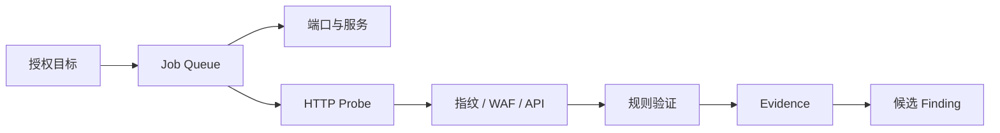

# 雪锋 SnowEdge · 扫描中心与自动解码

<p align="center"></p>

更新：2026-09-12。重启桌面程序后，在项目左侧进入「扫描中心」；「自动解码」是独立入口。沿用原数据库、身份、请求、报告和 AI 配置，无新增数据库迁移。



## 使用顺序

1. 在项目设置中填写目标授权范围。域名与通配子域范围需分别填写，例如 `example.test` 和 `*.example.test`。
2. 在扫描中心逐行粘贴域名、IP、HTTP(S) URL 或小网段。默认执行端口、HTTP/指纹、规则验证；发现模块可按需勾选。
3. 点击「开始扫描」。桌面程序自带后台工作进程，任务进度每 3 秒更新。独立部署服务时仍需启动既有 worker，或配置 `JOB_EMBEDDED_WORKERS`。
4. 展开结果查看端口、HTTP 状态、技术指纹、证据和候选发现；HTTP 证据旁可打开 AI 解读。AI 不会因一次提问自动启动额外扫描。

## 本次实现的能力与边界

| 功能 | 实际行为 |
| --- | --- |
| 批量存活与端口 | TCP 连接与 HTTP 响应确认；无响应表示未观察到响应，不等于确定离线。没有 ICMP/UDP 扫描。 |
| 服务识别 | SSH、FTP/SMTP、POP3、IMAP、MySQL 握手、Redis PING、HTTP(S) 响应；不能确认的服务标为未知或端口推测。 |
| HTTP Probe / Web 指纹 / WAF | 记录状态、标题、响应头；复用指纹规则识别 Web 技术和 WAF/CDN 迹象。未知开放 TCP 端口尝试 HTTP/HTTPS。WAF 是被动识别，不是绕过检测。 |
| 队列 | 持久化任务、资源并发限制、暂停、恢复、取消、失败重试、仅重试未响应目标。 |
| 检测链 | 当前响应指纹用于选择规则，规则结果关联父 HTTP 证据；命中后产生候选 Finding，附条件和响应摘要哈希。不是把指纹本身当作漏洞。 |
| 子域名 | 用户提供前缀的 DNS 解析；随机名称检测泛解析，对疑似泛解析结果标注且不自动加入资产。不是完整被动子域名源聚合。 |
| 目录 / JS / API | 用户提供目录、页面链接和脚本中的接口路径；比较随机不存在页面以减少统一错误页误报。动态变化的错误页仍需复核。 |
| 自定义规则 / Nuclei | 支持下文的 HTTP 模板子集；不等同完整 Nuclei 执行器。未支持字段拒绝导入，不静默跳过。 |
| 空间测绘 | FOFA、Hunter、Quake、Shodan 查询适配；加密保存 Key，按页展示，范围内结果可填入目标但不会自动扫描。须配置有效账户及额度，尚未使用真实付费账户联调。 |
| 全局 / 项目代理 | 项目优先，未指定项目路由时继承全局，支持明确直连覆盖。扫描中心 TCP 使用 HTTP CONNECT/SOCKS5，HTTP 使用所选代理。已有 HTTP/浏览器路由也继承全局。 |
| 凭据检查 | 用户提供的一组 HTTPS HTTP Basic 凭据，比较匿名/认证状态并检查密码格式；验证 TLS，不保存用户名或密码。未覆盖 SSH/数据库/表单登录等多协议凭据检查。 |
| OOB | 自建 HTTPS HTTP 回调，24 小时关联 token，收到后进入证据和候选发现。不包含公网回调服务部署、DNS 回调或 Interactsh 协议。 |
| 自动解码 | URL、HTML 实体、Unicode/Hex 转义、Hex、Base64/Base64URL、JWT。支持最多 5 层；歧义时由用户选择。JWT 不验证签名，哈希和加密内容不能直接还原。 |

解码只在本地服务内存处理，不保存输入或发送给 AI。默认工具箱不再重复展示解码工具；原工具 API 和已收藏的旧入口保留。

## 暂停和资源限制

- 暂停等待当前请求/最多 16 个 TCP 探测结束，在阶段边界停止。恢复点是最近完成的目标；未完成目标可能重复执行部分请求。相同扫描证据会复用，候选发现按既有逻辑去重。
- 服务重启后，工作进程租约过期的任务恢复入队；已暂停的任务保持暂停。失败会按队列策略重试，保留完成目标；取消/失败后也可手动重试。
- 每次最多 256 个目标、1024 个端口、8192 个目标/端口组合。URL 中指定的端口也会探测。
- 每目标最多 64 个 HTTP 入口；超过的数量在结果中明确显示。每页最多获取 200 KB 文本，不跟随重定向。普通资产发现允许自签名证书，凭据检查必须验证证书。
- 目录最多 40 项、子域前缀最多 100 项、每页最多抓取 10 个脚本并保留 200 个发现候选。长任务超时按队列策略处理，可缩小目标、端口与规则组合。
- DNS 子域名解析使用系统解析器，代理项目拒绝执行该阶段。旧工具箱的 DNS/TCP/TLS 诊断也会在代理启用时拒绝执行；不会悄悄绕过代理。

## 自定义规则示例

在扫描中心展开「检测规则」，粘贴以下 YAML。保存会替换本项目自定义规则，内置规则保留。

```yaml
id: example-status-public
name: 示例状态页公开
severity: low
products: []
paths: [/status]
method: GET
matchers-condition: and
matchers:
  - type: status
    status: [200]
  - type: word
    part: body
    words: [ExampleStatus]
    case-insensitive: false
```

内置检查为目录索引、Nginx 状态页、Prometheus 指标公开。需要针对具体产品的更多 POC 时，可导入符合上述格式的项目规则。

Nuclei 兼容范围：一个 `http`（或旧版 `requests`）块，GET/HEAD、BaseURL/RootURL 路径、status/word matcher、and/or、negative、case-insensitive。BaseURL 保留入口路径，RootURL 从站点根路径开始。raw、payload、DSL、regex、extractor、多请求、代码、网络协议、Interactsh 等未支持语法会报错。

## OOB 接入

需要一个由你管理的公网 HTTPS 地址，反向代理**仅** `/api/oob/callback/` 到本地服务的同一路径。例如使用现有反向代理配置：

```nginx
location /api/oob/callback/ {
    proxy_pass http://127.0.0.1:8000;
}
```

在界面填入公网根地址，再提供范围内模板，例如 `https://example.test/check?url={{oob-url}}`。程序生成本次唯一回调地址并对 URL 参数编码后发送 GET。收到回调只能证明带外交互发生，还需要核对触发组件与业务语义。此功能不会自动替你部署公网服务。

## 测绘适配参考

- [FOFA API](https://fofa.info/api)
- [Hunter](https://hunter.qianxin.com/)
- [Quake 官方客户端接口实现](https://github.com/360quake/quake_rs/blob/master/src/quake.rs)（使用 `quake.360.net`）
- [Shodan API](https://developer.shodan.io/api)
- [Nuclei HTTP 模板](https://docs.projectdiscovery.io/templates/protocols/http/basic-http)

API Key 只在软件内填写。查询响应使用大小限制并校验格式，不记录原始认证错误 URL；范围外资产不会自动进入扫描。真实平台查询可能消耗账户额度。
