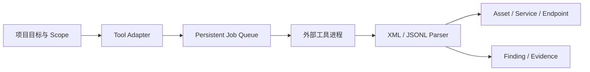
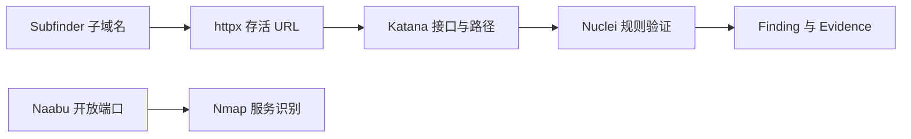

# SnowEdge 工具链

SnowEdge V1.8.1 增加统一工具适配层。外部工具继续使用各自正式可执行文件，SnowEdge 负责安装状态检测、受控参数、项目 Scope、任务队列、结果解析和 Evidence 关联。

## 首批适配器

| 工具 | 当前受控能力 | 输出映射 |
| --- | --- | --- |
| Nmap | `-Pn -sV --version-light`，端口由页面选择 | Asset、Service、Evidence |
| Subfinder | 单域名被动子域名发现 | Asset、Evidence |
| Naabu | 单目标、指定端口探测 | Asset、Service、Evidence |
| httpx | HTTP 状态、标题和技术探测 | Asset、Endpoint、Evidence |
| Katana | 深度 2 的页面与接口发现 | Endpoint、Evidence |
| Nuclei | 默认模板、受限速率的单目标检测 | Finding、Evidence |

## 使用方法

1. 打开项目并进入“工具链”。
2. SnowEdge 会检查 PATH 中的工具；也可以填写现有可执行文件的绝对路径。
3. 选择工具、填写当前项目范围内的目标；Nmap 和 Naabu 可设置端口。
4. 任务进入现有任务中心，执行结果自动归入项目数据。

也可以选择“基础设施识别”“Web 深度评估”“外部资产发现”或“单目标综合评估”。系统会创建一条持久化流程，当前步骤完成后才会启动下一步，并明确列出因未安装而跳过的工具。

步骤结果会去重后自动传递。Naabu 将主机和开放端口交给 Nmap；Subfinder 将范围内域名交给 httpx；httpx 和 Katana 将 URL 交给后续 Web 工具。每步最多扇出 100 个目标，传递 URL 会移除查询参数和片段。流程状态保存在数据库中，失败时可在流程运行区域重试对应步骤。

页面不接受任意命令行参数。每项工具使用代码中明确声明的参数预设；任务创建和实际执行前都会重新检查项目 Scope。标准输出限制为 8 MB，单次最多解析 10,000 条记录，任务默认 15 分钟超时。任务中心发出取消或暂停请求后，适配器会结束对应外部进程；重新执行会从该工具步骤开头开始。

工具由用户独立安装并遵循各自许可证。SnowEdge 仓库和安装包不直接分发这些第三方可执行文件。
